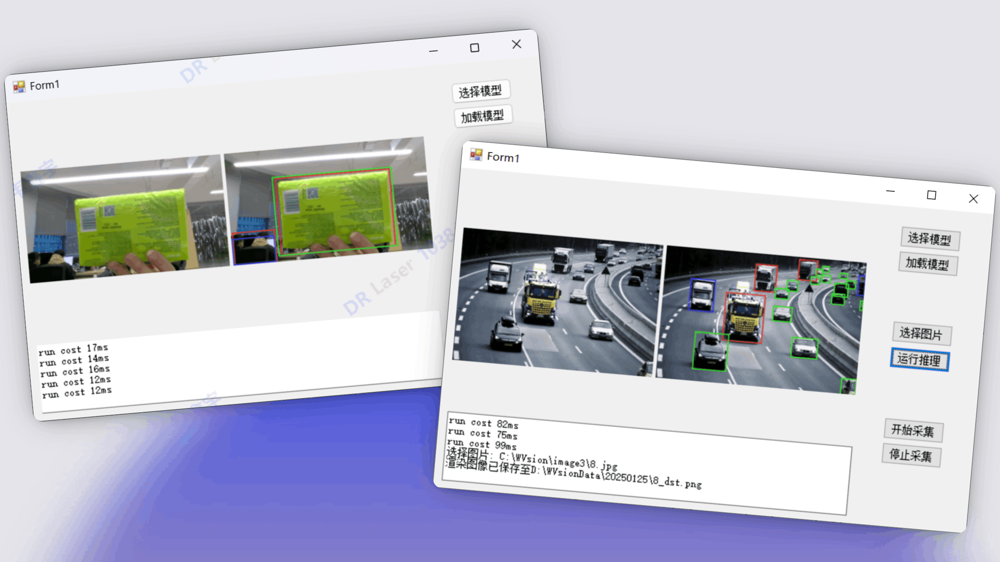
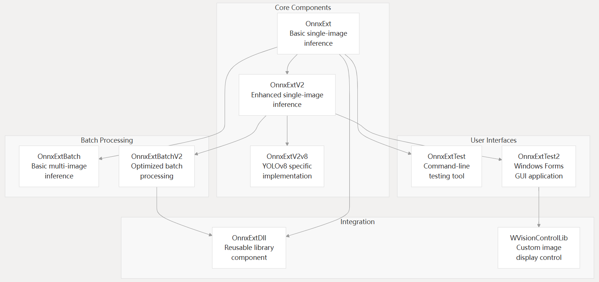
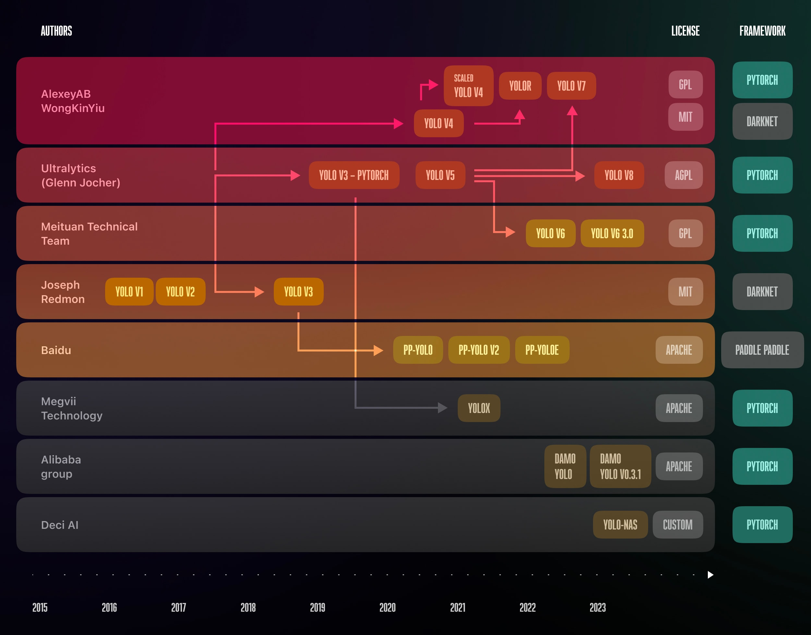

#### 基于ORT（ONNX Runtime）实现YOLOv5/v8模型推理的封装。

##### 支持功能

- [x] 支持GUI交互界面
- [x] 支持流媒体推理
- [x] 支持DLL调用
- [x] 优化前/后处理，缩短推理过程耗时（单张200MP图像推理耗时：GPU-CUDA<20ms，CPU<70ms）

##### 计划实现

- [ ] 增加对RT-DETR等模型的支持，用于小目标等不同检测需求

##### 项目文件结构

##### YOLO模型推出时间线

